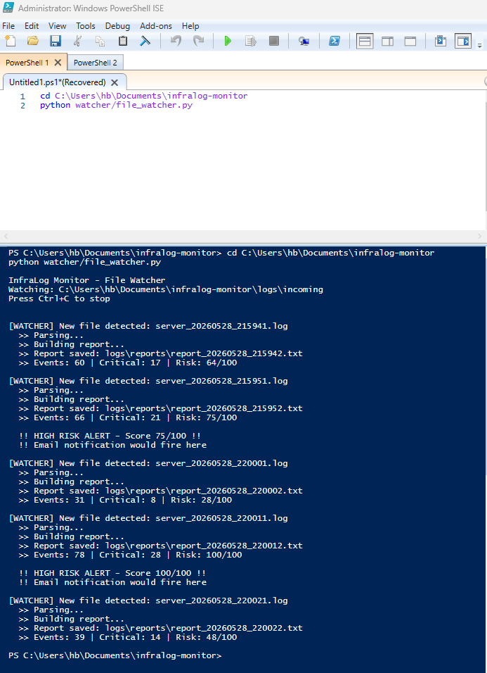
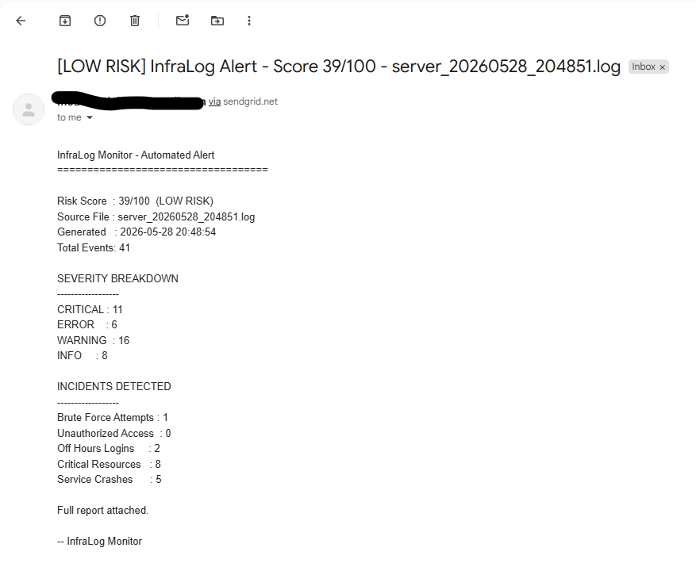
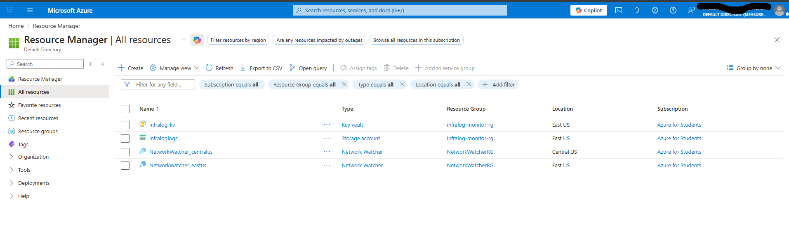
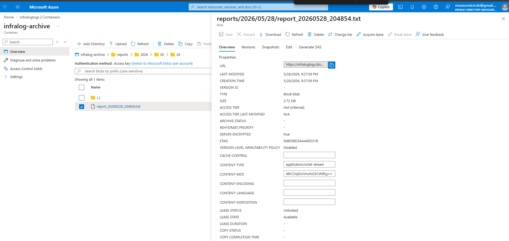
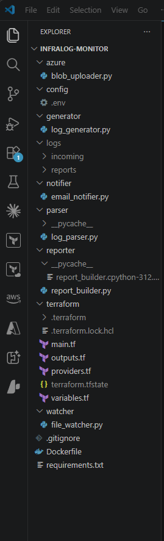

# InfraLog Monitor

Hybrid cloud infrastructure log monitoring tool — Python pipeline that parses server logs, detects security and performance incidents, scores risk, fires email alerts via SendGrid, and archives to Azure Blob Storage. Provisioned with Terraform, containerized with Docker.

---

## Demo

### Live Pipeline — Watcher detecting files and scoring risk in real time


### Email Alert — HIGH RISK notification delivered via SendGrid


### Azure Portal — Infrastructure provisioned with Terraform


### Azure Blob Storage — Logs and reports archived by date


### Project Structure — VS Code


---

## Tech Stack

| Tool | Purpose |
|---|---|
| Python 3.12 | Core application language |
| watchdog | Filesystem event monitoring |
| SendGrid | Transactional email alerts |
| Azure Blob Storage | Cloud log archiving |
| Azure Key Vault | Secure credential storage |
| Terraform | Infrastructure as Code |
| Docker | Containerization |

---

## How It Works
Log Generator → drops .log files every 10 seconds
File Watcher  → detects new files instantly
Parser        → categorizes incidents by type and severity
Reporter      → builds formatted report with risk score
Notifier      → fires email alert if risk score >= 70
Blob Uploader → archives logs and reports to Azure

## Incident Detection

- **Auth & Access** — brute force attempts, unauthorized access, off-hours logins
- **Resource Health** — CPU, memory, and disk threshold breaches
- **Service Stability** — crashes, restarts, connection pool exhaustion

## Risk Scoring
Score = min(100, (CRITICAL x 3) + (ERROR x 1))
0-39   = LOW RISK
40-69  = MEDIUM RISK
70-100 = HIGH RISK → triggers email alert

---

## Setup

### Prerequisites
- Python 3.12+
- Docker Desktop
- Azure CLI
- Terraform

### Local Run

```bash
# Install dependencies
pip install -r requirements.txt

# Terminal 1 — start watcher
python watcher/file_watcher.py

# Terminal 2 — start generator
python generator/log_generator.py
```

### Azure Deployment

```bash
# Configure credentials
cp config/.env.example config/.env
# Fill in SENDGRID_API_KEY, EMAIL_FROM, EMAIL_TO

# Provision infrastructure
cd terraform
terraform init
terraform apply

# Add connection string to .env
terraform output -raw storage_connection_string

# Build and run container
docker build -t infralog-monitor .
docker run --rm -it infralog-monitor
```

---

## Project Structure
infralog-monitor/
├── generator/        # Synthetic log file generator
├── parser/           # Log parsing and incident detection
├── reporter/         # Report building and risk scoring
├── watcher/          # Filesystem event handler
├── notifier/         # SendGrid email alerts
├── azure/            # Azure Blob Storage uploader
├── terraform/        # Infrastructure as Code
├── config/           # Environment variables (gitignored)
├── screenshots/      # Project screenshots
├── Dockerfile
└── requirements.txt